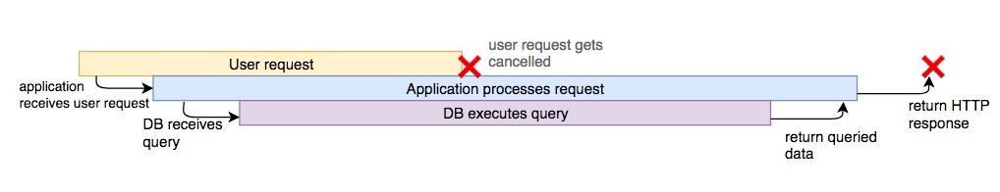
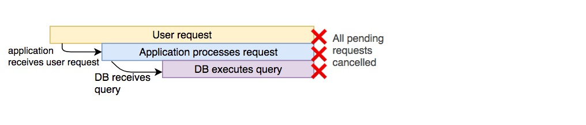

# 上下文中断在Go语言中的使用
越来越多的小伙伴开始使用Go语言开发应用，大多数情况会使用上下文操作，如进行HTTP调用，或从数据库中获取数据，或与go-routines执行异步操作。 最常见的用途是传递可供所有下游操作使用的常用数据。


## 为什么我们需要中断操作？
通常情况下我们我们的应该通过HTTP 发起请求，然后查询数据库再通过HTTP请求将数据返回


但是，如果用户在中间取消请求会发生什么？ 例如，如果客户端中间请求关闭浏览器，就可能发生这种情况。 如果没有取消，应用服务器和数据库将继续工作资源会被浪费：

理想情况下，如果我们知道进程（在本例中为HTTP请求）停止，我们希望进程的所有下游组件都需要停止：


## Go语言中的上下文中断:
现在我们知道为什么需要中断，让我们看看如何在Go中实现它。

我们通常需要实现两种方式的中断：

    1. 监听中断
    2. 发出中断

首先我们看看Context
```go
    // context
    type Context interface {               
        Done() <-chan struct{}      
        Err() error 
        Deadline() (deadline time.Time, ok bool)
        Value(key interface{}) interface{}
    }
```

context.Context 接口

  * context包里的方法是线程安全的，可以被多个线程使用
  * 当Context被canceled或是timeout, Done返回一个被closed 的channel
  * 在Done的channel被closed后, Err代表被关闭的原因
  * 如果存在, Deadline 返回Context将要关闭的时间
  * 如果存在，Value 返回与 key 相关了的值，不存在返回 nil

### 监听中断：
让我们实现一个两秒钟超时HTTP服务。 如果请求在此之前被取消，我们立即返回结果：

```go
    func main() {
      // Create an HTTP server that listens on port 8000
      http.ListenAndServe(":8000", http.HandlerFunc(func(w http.ResponseWriter, r *http.Request) {
        ctx := r.Context()
        // This prints to STDOUT to show that processing has started
        fmt.Fprint(os.Stdout, "processing request\n")
        // We use `select` to execute a peice of code depending on which
        // channel receives a message first
        select {
        case <-time.After(2 * time.Second):
          // If we receive a message after 2 seconds
          // that means the request has been processed
          // We then write this as the response
          w.Write([]byte("request processed"))
        case <-ctx.Done():
          // If the request gets cancelled, log it
          // to STDERR
          fmt.Fprint(os.Stderr, "request cancelled\n")
        }
      }))
    }
```

运行上面代码，如果你在两秒钟以内关闭浏览器你会看的“request cancelled”

### 发出中断

如果你需要取消操作，则必须通过上下文发出中断操作。 我们可以使用上下文包中的WithCancel函数完成，假设我们一次请求有2个依赖操作。 在这里，“依赖”意味着如果一个人失败了，那么另一个完成就没有意义了。 在这种情况下，如果我们如果道其中一个操作失败了，我们就中断所有操作。
```go
    func operation1(ctx context.Context) error {
      // Let's assume that this operation failed for some reason
      // We use time.Sleep to simulate a resource intensive operation
      time.Sleep(100 * time.Millisecond)
      return errors.New("failed")
    }
    func operation2(ctx context.Context) {
      // We use a similar pattern to the HTTP server
      // that we saw in the earlier example
      select {
      case <-time.After(500 * time.Millisecond):
        fmt.Println("done")
      case <-ctx.Done():
        fmt.Println("halted operation2")
      }
    }
    func main() {
      // Create a new context
      ctx := context.Background()
      // Create a new context, with its cancellation function
      // from the original context
      ctx, cancel := context.WithCancel(ctx)
      // Run two operations: one in a different go routine
      go func() {
        err := operation1(ctx)
        // If this operation returns an error
        // cancel all operations using this context
        if err != nil {
          cancel()
        }
      }()
      // Run operation2 with the same context we use for operation1
      operation2(ctx)
    }
```


## 基于时间的中断

很多情况下，我们的服务要满足SLA的要求。我们可能需要基于超时机制进行中断！当然我们还可以在RPC请求与DB操作中使用！

```go
    // The context will be cancelled after 3 seconds
    // If it needs to be cancelled earlier, the `cancel` function can
    // be used, like before
    ctx, cancel := context.WithTimeout(ctx, 3*time.Second)
    // The context will be cancelled on 2009-11-10 23:00:00
    ctx, cancel := context.WithDeadline(ctx, time.Date(2009, time.November, 10, 23, 0, 0, 0, time.UTC))
```

例如，对外部服务进行HTTP API调用。 如果请求时间过长，最好提前失败并取消请求：
```go
    func main() {
      // Create a new context
      // With a deadline of 100 milliseconds
      ctx := context.Background()
      ctx, _ = context.WithTimeout(ctx, 100*time.Millisecond)
      // Make a request, that will call the google homepage
      req, _ := http.NewRequest(http.MethodGet, "http://google.com", nil)
      // Associate the cancellable context we just created to the request
      req = req.WithContext(ctx)
      // Create a new HTTP client and execute the request
      client := &http.Client{}
      res, err := client.Do(req)
      // If the request failed, log to STDOUT
      if err != nil {
        fmt.Println("Request failed:", err)
        return
      }
      // Print the statuscode if the request succeeds
      fmt.Println("Response received, status code:", res.StatusCode)
    }
```

总结：

 

所有的context的父对象，也叫根对象，是一个空的context，它不能被取消，它没有值，从不会被取消，也没有超时时间，它常常作为处理request的顶层context存在，然后通过WithCancel、WithTimeout函数来创建子对象来获得cancel、timeout的能力

当顶层的request请求函数结束后，我们就可以cancel掉某个context，从而通知别的routine结束

WithValue方法可以把键值对加入context中，让不同的routine获取