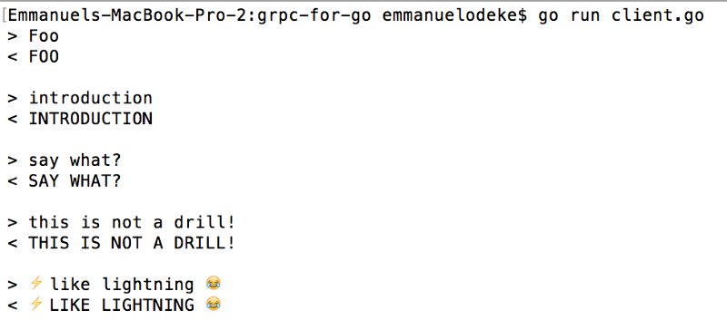

# OpenCensus for Go gRPC developers

In this tutorial, we’ll examine how to use OpenCensus in your gRPC projects in the Go programming language for observability both into your server and then client! We’ll then examine how we can integrate with OpenCensus exporters from AWS X-Ray, Prometheus, Zipkin and Google Stackdriver Tracing and Monitoring.

gRPC is a modern high performance framework for remote procedure calls, powered by Protocol Buffer encoding. It is polyglot in nature, accessible and useable on a variety of environments ranging from mobile mobile devices, general purpose computers to data centres for distributed computing, and it is implemented in a variety of languages: Go, Java, Python, C/C++, Node.js, Ruby, PHP https://grpc.io/

OpenCensus is a modern observability framework for distributed tracing and monitoring across microservices and monoliths alike. It is polyglot in nature, accessible and useable too on a variety of environments from mobile devices, general purpose computers and data centres for distributed computing and it is implemented in a plethora of languages: Go, Java, Python, C++, Node.js, Ruby, PHP, C#(coming soon) https://opencensus.io/

Go is a modern programming language that powers the cloud as well as modern systems programming, making it easy to build simple, reliable and efficient software. It is a cross platform, fast, statically typed and a simple language https://golang.org

With the above three introductory paragraphs, perhaps you already noticed the common themes: high performance, distributed computing, modern nature, cross platform, simplicity, reliability — those points make the three a match #compatibility, hence the motivation for this tutorial/article.

For this tutorial, we have a company’s service that’s in charge of capitalizing letters sent in from various clients and internal microservices using gRPC.

To use gRPC, we firstly need to create Protocol Buffer definitions and from those, use the Protocol Buffer compiler with the gRPC plugin to generate code stubs. If you need to take a look at the pre-requisites or a primer into gRPC, please check out this article https://grpc.io/docs/

Our service takes in a payload with bytes, and then capitalizes them on the server.
```go
syntax = "proto3";

package rpc;

message Payload {
    int32 id    = 1;
    bytes data  = 2;
}

service Fetch {
    rpc Capitalize(Payload) returns (Payload) {}
}
```

To generate code, we’ll firstly put our definition in a file called “defs.proto” and move it into our “rpc” directory and then run this command to generate gRPC code stubs in Go, using this Makefile below:

```sh
protoc:
	protoc -I rpc rpc/defs.proto --go_out=plugins=grpc:rpc
```

`make` should then generate code that’ll make the directory structure look like this
```
|-rpc/
   |-defs.proto
   |-defs.pb.go
```
After the code generation, we now need to add the business logic into the server

## Plain Server

Our server’s sole purpose is to capitalize content sent in and send it back to the client. With gRPC, as previously mentioned, the protoc plugin generated code for a server interface. This allows you create your own custom logic of operation, as we shall do below with a custom object that implements the `Capitalize` method.

```go
package main

import (
	"bytes"
	"context"
	"log"
	"net"

	"google.golang.org/grpc"

	"./rpc"
)

type fetchIt int

// Compile time assertion that fetchIt implements FetchServer.
var _ rpc.FetchServer = (*fetchIt)(nil)

func (fi *fetchIt) Capitalize(ctx context.Context, in *rpc.Payload) (*rpc.Payload, error) {
	out := &rpc.Payload{
		Data: bytes.ToUpper(in.Data),
	}
	return out, nil
}

func main() {
	addr := ":9988"
	ln, err := net.Listen("tcp", addr)
	if err != nil {
		log.Fatalf("gRPC server: failed to listen: %v", err)
	}
	srv := grpc.NewServer()
	rpc.RegisterFetchServer(srv, new(fetchIt))
	log.Printf("fetchIt gRPC server serving at %q", addr)
	if err := srv.Serve(ln); err != nil {
		log.Fatalf("gRPC server: error serving: %v", err)
	}
}

```

With that, we can now monetize access to generate money $$$. In order to accomplish that though, we need to create clients that speak gRPC and for that please see below:

## Plain Client

Our client makes a request to the gRPC server above, sending content that then gets capitalized and printed to our screen. It is interactive and can be run simply by `go run client.go`

```go
package main

import (
	"bufio"
	"context"
	"fmt"
	"log"
	"os"

	"google.golang.org/grpc"

	"./rpc"
)

func main() {
	serverAddr := ":9988"
	cc, err := grpc.Dial(serverAddr, grpc.WithInsecure())
	if err != nil {
		log.Fatalf("fetchIt gRPC client failed to dial to server: %v", err)
	}
	fc := rpc.NewFetchClient(cc)

	fIn := bufio.NewReader(os.Stdin)
	for {
		fmt.Print("> ")
		line, _, err := fIn.ReadLine()
		if err != nil {
			log.Fatalf("Failed to read a line in: %v", err)
		}

		ctx := context.Background()
		out, err := fc.Capitalize(ctx, &rpc.Payload{Data: line})
		if err != nil {
			log.Printf("fetchIt gRPC client got error from server: %v", err)
			continue
		}
		fmt.Printf("< %s\n\n", out.Data)
	}
}
```

which when run interactively, will look like this



And now that we have a client, we are open for business!!

## Aftermath
It’s been 1 hour since launch. Tech blogs and other programmers are sharing news of our service all over their internet and social media; our service just got so popular and is being talked about all around the business world too, high fives are shared and congrats shared — after this celebration, we all go back home and call it a night. It’s the latest and greatest API in the world, it is off the charts, customers from all over the world come in, what could go wrong?

It hits 3AM and our servers start getting over loaded. Response time degrades overall for everyone. This however is only noticed after one of the engineers tried to give a demo to their family that they restlessly awoke at 2:00AM due to excitement, but the service is taking 15ms to give back a response. In normal usage, we saw about at most 1ms response time. What is causing the sluggishness of the system? When did our service start getting slow? What is the solution? Throw more servers at it? How many servers should we throw at it? How do we know what is going wrong? When? How can the engineering and business teams figure out what to optimize or budget for? How can we tell we’ve successfully optimized the system and removed bottlenecks?

In comes in OpenCensus: OpenCensus is a single distribution of libraries for distributed tracing and monitoring for modern and distributed systems. OpenCensus can help answer mostly all of those questions that we asked. By “mostly”, I mean that it can answer the observability related questions such as: When did the latency increase? Why? How did it increase? By how much? What part of the system is the slowest? How can we optimize and assert successful changes?

OpenCensus is simple to integrate and use, it adds very low latency to your applications and it is already integrated into both gRPC and HTTP transports.

OpenCensus allows you to trace and measure once and then export to a variety of backends like Prometheus, AWS X-Ray, Stackdriver Tracing and Monitoring, Jaeger, Zipkin etc. With that mentioned, let’s get started.

## Part 1: observability by instrumenting the server

To collect statistics from gRPC servers, OpenCensus is already integrated with gRPC out of the box, and one just has to `import go.opencensus.io/plugin/ocgrpc`. And then also subscribe to the gRPC server views. This amounts to a 7 line change
```sh
10a11,13
> 	"go.opencensus.io/plugin/ocgrpc"
> 	"go.opencensus.io/stats/view"
> 
32c35,38
< 	srv := grpc.NewServer()
---
> 	if err := view.Register(ocgrpc.DefaultServerViews...); err != nil {
> 		log.Fatalf("Failed to register gRPC server views: %v", err)
> 	}
> 	srv := grpc.NewServer(grpc.StatsHandler(new(ocgrpc.ServerHandler)))
```
and then to trace the application, we’ll start a span on entering the function, then end it on exiting. This amounts to a 7 line change too

```sh
12a13
> 	"go.opencensus.io/trace"
22a24,29
> 	_, span := trace.StartSpan(ctx, "(*fetchIt).Capitalize")
> 	defer span.End()
> 
> 	span.Annotate([]trace.Attribute{
> 		trace.Int64Attribute("len", int64(len(in.Data))),
> 	}, "Data in")
```

In the tracing, notice the` trace.StartSpan(ctx, "(*fetchIt).Capitalize")` ?We take a `context.Context` as the first argument, to use context propagation which carries over RPC specific information about a request to uniquely identify it

## How do we examine that “observability”?

Now that we’ve got tracing and monitoring in, let’s export that data out. Earlier on, I made claims that with OpenCensus you collect and trace once, then export to a variety of backends, simulatenously. Well, it is time for me to walk that talk!

To do that, we’ll need to use the exporter integrations in our app to send data to our favorite backends: AWS X-Ray, Prometheus, Stackdriver Tracing and Monitoring

```sh
7a8
> 	"net/http"
10a12,14
> 	xray "github.com/census-instrumentation/opencensus-go-exporter-aws"
> 	"go.opencensus.io/exporter/prometheus"
> 	"go.opencensus.io/exporter/stackdriver"
12a17
> 	"go.opencensus.io/trace"
22a28,33
> 	_, span := trace.StartSpan(ctx, "(*fetchIt).Capitalize")
> 	defer span.End()
> 
> 	span.Annotate([]trace.Attribute{
> 		trace.Int64Attribute("len", int64(len(in.Data))),
> 	}, "Data in")
40a52,56
> 
> 	// OpenCensus exporters
> 	createAndRegisterExporters()
> 
> 	// Finally serve
44a61,97
> 
> func createAndRegisterExporters() {
> 	// For demo purposes, set this to always sample.
> 	trace.ApplyConfig(trace.Config{DefaultSampler: trace.AlwaysSample()})
> 	// 1. Prometheus
> 	prefix := "fetchit"
> 	pe, err := prometheus.NewExporter(prometheus.Options{
> 		Namespace: prefix,
> 	})
> 	if err != nil {
> 		log.Fatalf("Failed to create Prometheus exporter: %v", err)
> 	}
> 	view.RegisterExporter(pe)
> 	// We need to expose the Prometheus collector via an endpoint /metrics
> 	go func() {
> 		mux := http.NewServeMux()
> 		mux.Handle("/metrics", pe)
> 		log.Fatal(http.ListenAndServe(":9888", mux))
> 	}()
> 
> 	// 2. AWS X-Ray
> 	xe, err := xray.NewExporter(xray.WithVersion("latest"))
> 	if err != nil {
> 		log.Fatalf("Failed to create AWS X-Ray exporter: %v", err)
> 	}
> 	trace.RegisterExporter(xe)
> 
> 	// 3. Stackdriver Tracing and Monitoring
> 	se, err := stackdriver.NewExporter(stackdriver.Options{
> 		MetricPrefix: prefix,
> 	})
> 	if err != nil {
> 		log.Fatalf("Failed to create Stackdriver exporter: %v", err)
> 	}
> 	view.RegisterExporter(se)
> 	trace.RegisterExporter(se)
> }
```

to finally give this code

```go
package main

import (
	"bytes"
	"context"
	"log"
	"net"
	"net/http"

	"google.golang.org/grpc"

	xray "github.com/census-instrumentation/opencensus-go-exporter-aws"
	"go.opencensus.io/exporter/prometheus"
	"go.opencensus.io/exporter/stackdriver"
	"go.opencensus.io/plugin/ocgrpc"
	"go.opencensus.io/stats/view"
	"go.opencensus.io/trace"

	"./rpc"
)

type fetchIt int

// Compile time assertion that fetchIt implements FetchServer.
var _ rpc.FetchServer = (*fetchIt)(nil)

func (fi *fetchIt) Capitalize(ctx context.Context, in *rpc.Payload) (*rpc.Payload, error) {
	_, span := trace.StartSpan(ctx, "(*fetchIt).Capitalize")
	defer span.End()

	span.Annotate([]trace.Attribute{
		trace.Int64Attribute("len", int64(len(in.Data))),
	}, "Data in")
	out := &rpc.Payload{
		Data: bytes.ToUpper(in.Data),
	}
	return out, nil
}

func main() {
	addr := ":9988"
	ln, err := net.Listen("tcp", addr)
	if err != nil {
		log.Fatalf("gRPC server: failed to listen: %v", err)
	}
	if err := view.Register(ocgrpc.DefaultServerViews...); err != nil {
		log.Fatalf("Failed to register gRPC server views: %v", err)
	}
	srv := grpc.NewServer(grpc.StatsHandler(new(ocgrpc.ServerHandler)))
	rpc.RegisterFetchServer(srv, new(fetchIt))
	log.Printf("fetchIt gRPC server serving at %q", addr)

	// OpenCensus exporters
	createAndRegisterExporters()

	// Finally serve
	if err := srv.Serve(ln); err != nil {
		log.Fatalf("gRPC server: error serving: %v", err)
	}
}

func createAndRegisterExporters() {
	// For demo purposes, set this to always sample.
	trace.ApplyConfig(trace.Config{DefaultSampler: trace.AlwaysSample()})
	// 1. Prometheus
	prefix := "fetchit"
	pe, err := prometheus.NewExporter(prometheus.Options{
		Namespace: prefix,
	})
	if err != nil {
		log.Fatalf("Failed to create Prometheus exporter: %v", err)
	}
	view.RegisterExporter(pe)
	// We need to expose the Prometheus collector via an endpoint /metrics
	go func() {
		mux := http.NewServeMux()
		mux.Handle("/metrics", pe)
		log.Fatal(http.ListenAndServe(":9888", mux))
	}()

	// 2. AWS X-Ray
	xe, err := xray.NewExporter(xray.WithVersion("latest"))
	if err != nil {
		log.Fatalf("Failed to create AWS X-Ray exporter: %v", err)
	}
	trace.RegisterExporter(xe)

	// 3. Stackdriver Tracing and Monitoring
	se, err := stackdriver.NewExporter(stackdriver.Options{
		MetricPrefix: prefix,
	})
	if err != nil {
		log.Fatalf("Failed to create Stackdriver exporter: %v", err)
	}
	view.RegisterExporter(se)
	trace.RegisterExporter(se)
}
```

and with the following variables set in our environment

## Part 2: observability by instrumenting the client

and then for client monitoring, we’ll just do the same thing for gRPC stats handler except using the ClientHandler and then also start and stop a trace and that’s it, collectively giving this diff below
```sh
7a8
> 	"net/http"
11a13,19
> 	xray "github.com/census-instrumentation/opencensus-go-exporter-aws"
> 	"go.opencensus.io/exporter/prometheus"
> 	"go.opencensus.io/exporter/stackdriver"
> 	"go.opencensus.io/plugin/ocgrpc"
> 	"go.opencensus.io/stats/view"
> 	"go.opencensus.io/trace"
> 
17c25
< 	cc, err := grpc.Dial(serverAddr, grpc.WithInsecure())
---
> 	cc, err := grpc.Dial(serverAddr, grpc.WithInsecure(), grpc.WithStatsHandler(new(ocgrpc.ClientHandler)))
22a31,38
> 	// OpenCensus exporters for the client since disjoint
> 	// and your customers will usually want to have their
> 	// own statistics too.
> 	createAndRegisterExporters()
> 	if err := view.Register(ocgrpc.DefaultClientViews...); err != nil {
> 		log.Fatalf("Failed to register gRPC client views: %v", err)
> 	}
> 
31c47
< 		ctx := context.Background()
---
> 		ctx, span := trace.StartSpan(context.Background(), "Client.Capitalize")
32a49
> 		span.End()
39c56,93
< }
\ No newline at end of file
---
> }
> 
> func createAndRegisterExporters() {
> 	// For demo purposes, set this to always sample.
> 	trace.ApplyConfig(trace.Config{DefaultSampler: trace.AlwaysSample()})
> 	// 1. Prometheus
> 	prefix := "fetchit"
> 	pe, err := prometheus.NewExporter(prometheus.Options{
> 		Namespace: prefix,
> 	})
> 	if err != nil {
> 		log.Fatalf("Failed to create Prometheus exporter: %v", err)
> 	}
> 	view.RegisterExporter(pe)
> 	// We need to expose the Prometheus collector via an endpoint /metrics
> 	go func() {
> 		mux := http.NewServeMux()
> 		mux.Handle("/metrics", pe)
> 		log.Fatal(http.ListenAndServe(":9889", mux))
> 	}()
> 
> 	// 2. AWS X-Ray
> 	xe, err := xray.NewExporter(xray.WithVersion("latest"))
> 	if err != nil {
> 		log.Fatalf("Failed to create AWS X-Ray exporter: %v", err)
> 	}
> 	trace.RegisterExporter(xe)
> 
> 	// 3. Stackdriver Tracing and Monitoring
> 	se, err := stackdriver.NewExporter(stackdriver.Options{
> 		MetricPrefix: prefix,
> 	})
> 	if err != nil {
> 		log.Fatalf("Failed to create Stackdriver exporter: %v", err)
> 	}
> 	view.RegisterExporter(se)
> 	trace.RegisterExporter(se)
> }
```

or this which now becomes this code

```go
package main

import (
	"bufio"
	"context"
	"fmt"
	"log"
	"net/http"
	"os"

	"google.golang.org/grpc"

	xray "github.com/census-instrumentation/opencensus-go-exporter-aws"
	"go.opencensus.io/exporter/prometheus"
	"go.opencensus.io/exporter/stackdriver"
	"go.opencensus.io/plugin/ocgrpc"
	"go.opencensus.io/stats/view"
	"go.opencensus.io/trace"

	"./rpc"
)

func main() {
	serverAddr := ":9988"
	cc, err := grpc.Dial(serverAddr, grpc.WithInsecure(), grpc.WithStatsHandler(new(ocgrpc.ClientHandler)))
	if err != nil {
		log.Fatalf("fetchIt gRPC client failed to dial to server: %v", err)
	}
	fc := rpc.NewFetchClient(cc)

	// OpenCensus exporters for the client since disjoint
	// and your customers will usually want to have their
	// own statistics too.
	createAndRegisterExporters()
	if err := view.Register(ocgrpc.DefaultClientViews...); err != nil {
		log.Fatalf("Failed to register gRPC client views: %v", err)
	}

	fIn := bufio.NewReader(os.Stdin)
	for {
		fmt.Print("> ")
		line, _, err := fIn.ReadLine()
		if err != nil {
			log.Fatalf("Failed to read a line in: %v", err)
		}

		ctx, span := trace.StartSpan(context.Background(), "Client.Capitalize")
		out, err := fc.Capitalize(ctx, &rpc.Payload{Data: line})
		span.End()
		if err != nil {
			log.Printf("fetchIt gRPC client got error from server: %v", err)
			continue
		}
		fmt.Printf("< %s\n\n", out.Data)
	}
}

func createAndRegisterExporters() {
	// For demo purposes, set this to always sample.
	trace.ApplyConfig(trace.Config{DefaultSampler: trace.AlwaysSample()})
	// 1. Prometheus
	prefix := "fetchit"
	pe, err := prometheus.NewExporter(prometheus.Options{
		Namespace: prefix,
	})
	if err != nil {
		log.Fatalf("Failed to create Prometheus exporter: %v", err)
	}
	view.RegisterExporter(pe)
	// We need to expose the Prometheus collector via an endpoint /metrics
	go func() {
		mux := http.NewServeMux()
		mux.Handle("/metrics", pe)
		log.Fatal(http.ListenAndServe(":9889", mux))
	}()

	// 2. AWS X-Ray
	xe, err := xray.NewExporter(xray.WithVersion("latest"))
	if err != nil {
		log.Fatalf("Failed to create AWS X-Ray exporter: %v", err)
	}
	trace.RegisterExporter(xe)

	// 3. Stackdriver Tracing and Monitoring
	se, err := stackdriver.NewExporter(stackdriver.Options{
		MetricPrefix: prefix,
	})
	if err != nil {
		log.Fatalf("Failed to create Stackdriver exporter: %v", err)
	}
	view.RegisterExporter(se)
	trace.RegisterExporter(se)
}
```


link https://github.com/orijtech/opencensus-for-grpc-go-developers