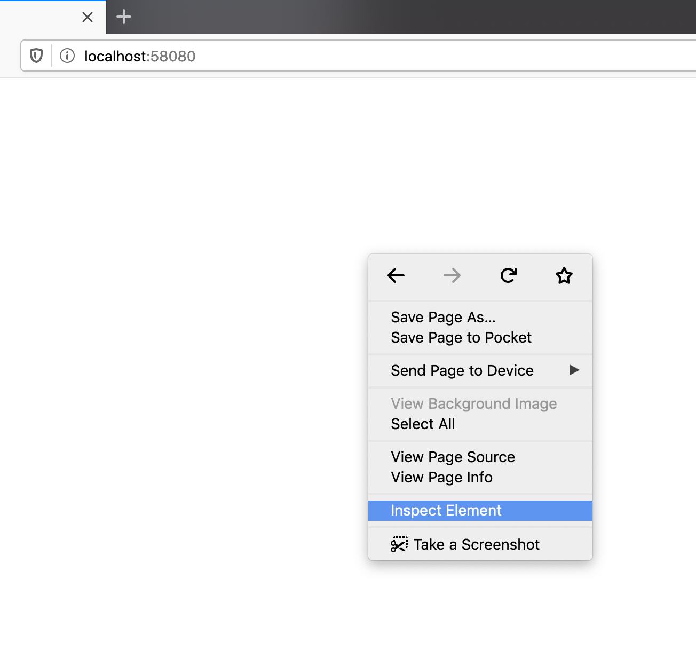
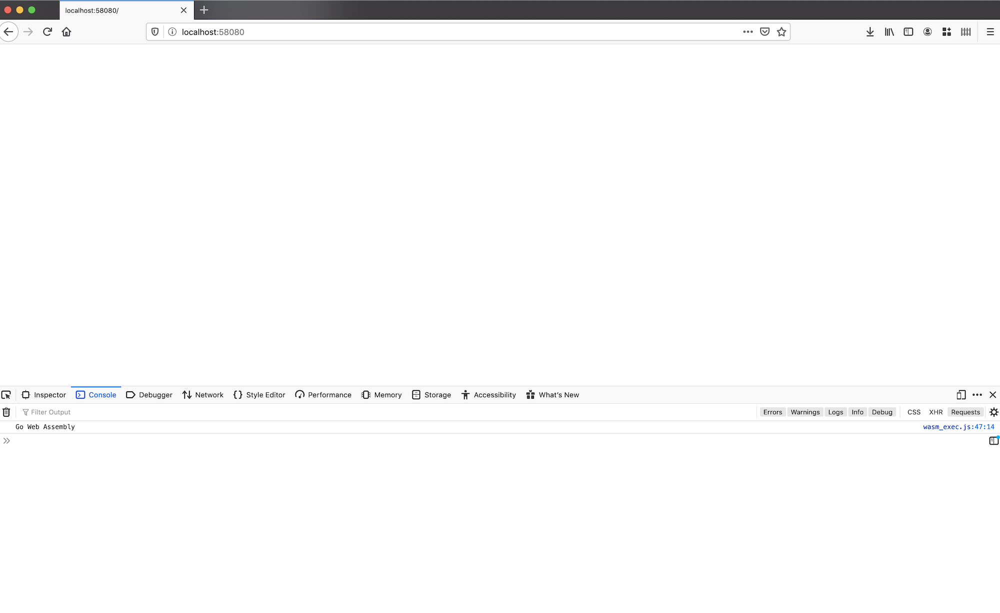
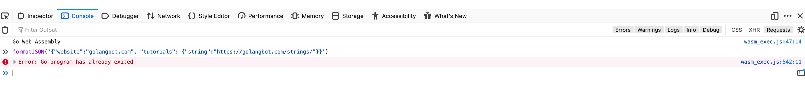
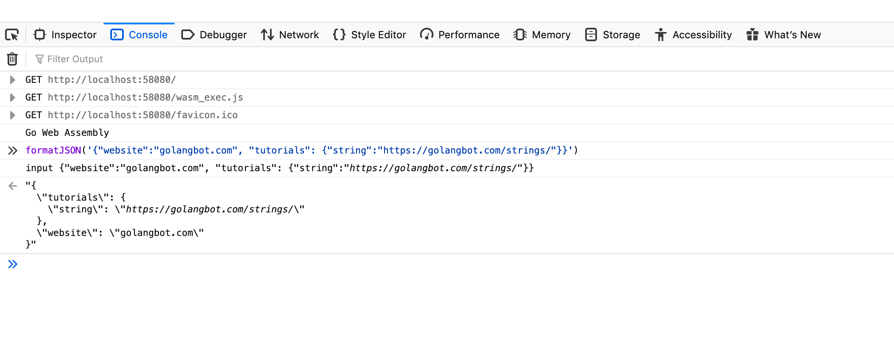
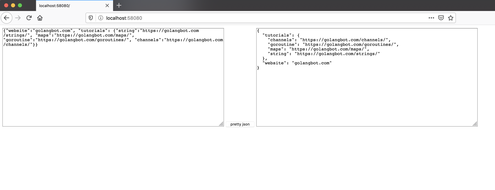
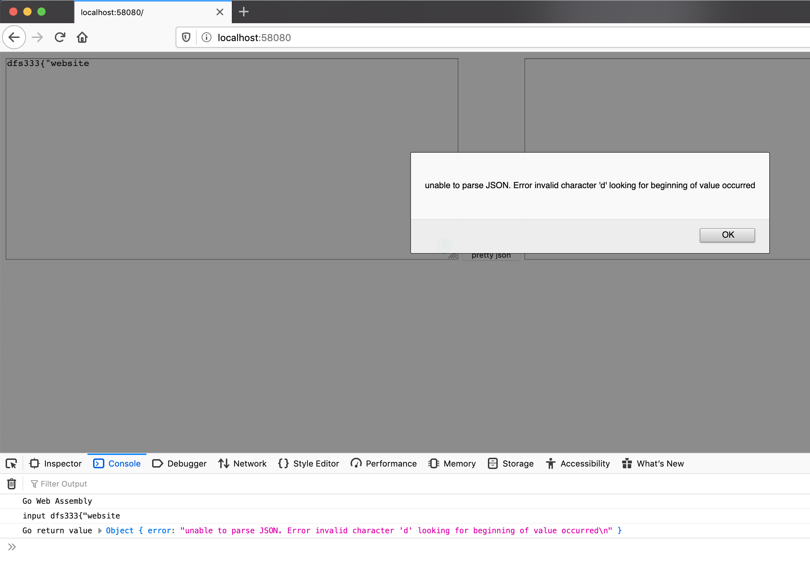

WebAssembly: Introduction to WebAssembly using Go
---


### What is WebAssembly?
JavaScript has been the only programming language that the browser understands. JavaScript has stood the test of time and it has been able to deliver the performance needed by most web applications. But when it comes to 3D games, VR, AR, and image editing apps, JavaScript is not quite up to the mark since it is interpreted. Although JavaScript engines such as Gecko and V8 have Just in Time compilation capabilities, JavaScript is not able to provide the high performance required by modern web applications.

WebAssembly(also known as wasm) is meant to solve this problem. WebAssembly is a virtual assembly language for the browser. When we say virtual, it means that it cannot be run natively on the underlying hardware. Since the browser can be running on any architecture, it is not possible for the browser to run WebAssembly directly on the underlying hardware. But this highly optimized virtual assembly format can be processed much quicker than vanilla JavaScript by modern browsers since it is compiled and is more close to the hardware architecture than JavaScript. The following figure shows where WebAssembly stands in the stack when compared to Javascript. It is closer to the Hardware than JavaScript.

                |-------------|
                | javascript  |
                |------------ |
                | WebAssembly |
                |-------------|
                |  Hareware   |
                |-------------|

The existing JavaScript engines have support to run WebAssembly's Virtual Assembly Code.

**WebAssembly is not meant to replace JavaScript. It is meant to operate hand in hand with JavaScript to take care of performance critical components of a web application**. It is possible to make calls from JavaScript to WebAssembly and vice versa.

**WebAssembly is not generally coded by hand, but rather, it is cross compiled from other high level programming languages. For example, it is possible to cross compile Go, C, C++, and Rust code to WebAssembly. Thus the module which has already been coded in some other programming language can be cross compiled to WebAssembly and used in the browser directly.**

### What are we developing?

In this tutorial, we will cross compile a Go application to WebAssembly and run it on the browser.

We will create a simple application that is used to format JSON 🙂. If a JSON without any formatting is passed as input, it will be formatted and printed.

For example, if the input JSON is

  ```json{.line-numbers}
  {"website":"golangbot.com", "tutorials": {"string":"https://golangbot.com/strings/", "maps":"https://golangbot.com/maps/", "goroutine":"https://golangbot.com/goroutines/", "channels":"https://golangbot.com/channels/"}}
  ```
It will be formatted as shown below and displayed in the browser.

  ```json{.line-numbers}
  {
    "tutorials": {
      "channels": "https://golangbot.com/channels/",
      "goroutine": "https://golangbot.com/goroutines/",
      "maps": "https://golangbot.com/maps/",
      "string": "https://golangbot.com/strings/"
    },
    "website": "golangbot.com"
  }
  ```
We will also be creating a UI for this application and manipulating the browser's DOM from Go using Javascript, but that's in the next tutorial.

This tutorial has been tested using Go Versions >= 1.13.

### Hello World WebAssembly Program Cross Compiled from Go
Let's start by writing a simple hello world program in Go, cross compile it to WebAssembly, and run it on the browser. We will further modify this application as the tutorial progress and convert it to our JSON formatting application.

Let's create the following directory structure inside the Documents directory.

  ```shell{.line-numbers}
  Documents/  
  └── webassembly
      ├── assets
      └── cmd
          ├── server
          └── wasm
  ```
The use of each of these folders will be clear as the tutorial progresses.

Create a file named main.go with the following contents inside `~/Documents/webassembly/cmd/wasm`.

  ```go{.line-numbers}
  package main

  import (  
      "fmt"
  )

  func main() {  
      fmt.Println("Go Web Assembly")
```
Let's cross compile the above Go program into WebAssembly. The following command will cross compile this Go program and place the output binary inside the assets folder.

```shell{.line-numbers}
cd ~/Documents/webassembly/cmd/wasm/  
GOOS=js GOARCH=wasm go build -o  ../../assets/json.wasm
```

The above command uses `js` as `GOOS` and `wasm` which is the short form for WebAssembly as the architecture. Running the above command will create the WebAssembly module json.wasm in the assets directory. Congrats, we have successfully cross compiled our first Go program to WebAssembly 😀.

One important fact is that it is possible to cross compile only the main package to WebAssembly. Hence we have written our code in the main package.

If you try to run this compiled binary in the terminal,
  ```shell{.line-numbers}
  $]~/Documents/webassembly/assets/json.wasm 
  ```
You will get the error `cannot execute binary file: Exec format error`. This is because this binary is a `wasm` binary and is supposed to be run inside a browser sandbox. The Linux/Mac OSes don't understand the format of this binary. Hence we get this error.

### Javascript Glue

As we already discussed, WebAssembly is supposed to exist hand in hand with JavaScript. Hence some JavaScript glue code is needed to import the WebAssembly Module we just created and run it in the browser. This code is already available in the Go installation. Let's go ahead and copy it to our assets directory.

  ```shell{.line-numbers}
  cp "$(go env GOROOT)/misc/wasm/wasm_exec.js" ~/Documents/webassembly/assets/
  ```

The above command copies the `wasm_exec.js` that contains the glue code to run WebAssembly into the `assets` directory.

As you would have guessed by now, `assets` folder will contain all the HTML, JavaScript, and wasm code which will be served using a web server later.

### Index.html
Now we have the wasm binary ready and also have the glue code. The next step is to create the index.html file and import our wasm binary.

Let's create a file named `index.html` in the `assets` directory with the following contents. This file contains boilerplate code to run the WebAssembly module and it can be found in the WebAssembly Wiki.
  ```html{.line-numbers}
  <html>  
      <head>
          <meta charset="utf-8"/>
          <script src="wasm_exec.js"></script>
          <script>
              const go = new Go();
              WebAssembly.instantiateStreaming(fetch("json.wasm"), go.importObject).then((result) => {
                  go.run(result.instance);
              });
          </script>
      </head>
      <body></body>
  </html>  
  ```
The current directory structure after creating index.html is provided below.
  ```shell{.line-numbers}
  Documents/  
  └── webassembly
      ├── assets
      │   ├── index.html
      │   ├── json.wasm
      │   └── wasm_exec.js
      └── cmd
          ├── server
          └── wasm
              └── main.go
  ```
Although the contents of `index.html` is standard boilerplate, a little understanding doesn't hurt. Let's try to understand the code in `index.html` a little. The instantiateStreaming function is used to initialize our `json.wasm` WebAssembly module. This function returns a WebAssembly instancewhich contains the list of WebAssembly functions that can be called from JavaScript. This is required to call our wasm functions from JavaScript. The use of this will be more clear as the tutorial progresses.

### WebServer
Now we have our JavaScript glue, index.html, and our wasm binary ready. The only missing piece is that we need to create a webserver to serve the contents of the assets folder. Let's do that now.

Create a file named main.go inside the server directory. The directory structure after creating main.go is provided below.

  ```shell{.line-numbers}
  Documents/  
  └── webassembly
      ├── assets
      │   ├── index.html
      │   ├── json.wasm
      │   └── wasm_exec.js
      └── cmd
          ├── server
          |   └── main.go
          └── wasm
              └── main.go
  ```            
Add the following code to `~/Documents/webassembly/cmd/server/main.go`.
  ```go{.line-numbers}
  package main

  import (  
      "fmt"
      "net/http"
  )

  func main() {  
      err := http.ListenAndServe(":9090", http.FileServer(http.Dir("../../assets")))
      if err != nil {
          fmt.Println("Failed to start server", err)
          return
      }
  }
  ```
The above program creates a file server listening at port `9090` with the root at our `assets` folder. Just what we wanted. Let's run the server and see our first WebAssembly program running.
  ```shell{.line-numbers}
  cd ~/Documents/webassembly/cmd/server/  
  go run main.go  
  ```
Now the server is listening at port 9090. Go to your favorite web browser and type http://localhost:9090/. You can see that the page is empty. Don't worry about it, we will create the UI in the upcoming sections.

Our interest right now is to see the JavaScript console. Right click and select inspect element in the browser.


  
This will open the developer console. Tap on the tab named `"console"`.

  
You can see the text `Go Web Assembly` printed in the console. Awesome, we have successfully run our first Web Assembly program written using Go. Our web assembly module cross compiled from Go has been delivered by our server to the browser and it has been executed successfully by the browser's Javascript engine.

Let's take this tutorial to the next level and write the code for our JSON formatter.

### Coding the JSON formatter
Add the following function to `~/Documents/webassembly/cmd/wasm/main.go`

  ```go{.line-numbers}
  func prettyJson(input string) (string, error) {  
      var raw interface{}
      if err := json.Unmarshal([]byte(input), &raw); err != nil {
          return "", err
      }
      pretty, err := json.MarshalIndent(raw, "", "  ")
      if err != nil {
          return "", err
      }
      return string(pretty), nil
  }
  ```
The `MarshalIndent` function takes 3 parameters as input. The first one is the raw unformatted JSON, the second one is the prefix to add to each new line of the JSON. In this case, we don't add a prefix. The third parameter is the string to be appended for each indent of our JSON. In our case, we give pass two spaces. Simply put, for each new indent of the JSON, two spaces will be added and hence the JSON will be formatted.

If the string  `{"website":"golangbot.com", "tutorials": {"string":"https://golangbot.com/strings/"}}` is passed as input to the above function, it will return the following formatted JSON string as output.
  ```json{.line-numbers}
  {
    "tutorials": {
      "string": "https://golangbot.com/strings/"
    },
    "website": "golangbot.com"
  }
  ```
### Exposing a function from Go to Javascript
Now we have the function ready but we are yet to expose this function to Javascript so that it can be called from the front end.

Go provides the `syscall/js` package which helps in exposing functions from Go to Javascript.

**The first step in exposing a function from Go to JavaScript is to create a Func type. Func is a wrapped Go function that can be called by JavaScript. The FuncOf function can be used to create a Func type.**

Add the following function to `~/Documents/webassembly/cmd/wasm/main.go`

  ```go{.line-numbers}
  func jsonWrapper() js.Func {  
          jsonFunc := js.FuncOf(func(this js.Value, args []js.Value) interface{} {
                  if len(args) != 1 {
                          return "Invalid no of arguments passed"
                  }
                  inputJSON := args[0].String()
                  fmt.Printf("input %s\n", inputJSON)
                  pretty, err := prettyJson(inputJSON)
                  if err != nil {
                          fmt.Printf("unable to convert to json %s\n", err)
                          return err.Error()
                  }
                  return pretty
          })
          return jsonFunc
  }
  ```
The FuncOf function takes a first class function function with two parameters and a interface{} return type as input. The function which is passed to FuncOf will be called synchronously from Javascript. The first parameter of this function is Javascript's this keyword. this refers to JavaScript's global object. The second parameter is a slice of []js.Value which represents the arguments that will be passed to the Javascript function call. In our case, it will be the unformatted JSON input string. Don't worry if this doesn't make sense. Once the program is complete, you will be able to understand better :).

We first check whether only one argument has been passed from Javascript in line no. 3. This check is needed because we expect only one JSON string argument. If not we return a string message stating `Invalid no of arguments passed`. We do not explicitly return any error type from Go to Javascript. 

We get the JSON input using `args[0].String()`. This represents the first parameter passed from JavaScript. This will be more clear as the tutorial progresses. After the input JSON is obtained, we call the prettyJson function in line no. 8, and return the output.


**When returning a value from Go to Javascript, the ValueOf function will be used automatically by the compiler to convert the Go value to a JavaScript value**. In this case, we are returning a string from Go, hence it will be converted to the corresponding JavaScript's string type using `js.ValueOf()` by the compiler.

We assign the `FuncOf`'s return value to jsonFunc. Now `jsonFunc` contains the function which will be called from Javascript. We return `jsonFunc` in line no. 15.

Now we have the function ready which can be called from Javascript. We are still one step away.

We need to expose the function we just created so that it can be called from Javascript. The way we will expose the Go function to Javascript is by setting the formatJSON string property of JavaScript's global object to the js.Func returned by `jsonWrapper()`.

The line of code that does this is,
  ```js{.line-numbers}
  js.Global().Set("formatJSON", jsonWrapper())  
  ```
Add this to the end of the `main()` function. In the above code, we have set the formatJSON property of Javascript's Global object to the return value of `jsonWrapper()` function. Now the jsonFunc which format's the JSON can be called from JavaScript using the function name formatJSON.

  ```go{.line-numbers}
  package main

  import (  
      "fmt"
      "encoding/json"
      "syscall/js"
  )

  func prettyJson(input string) (string, error) {  
          var raw interface{}
          if err := json.Unmarshal([]byte(input), &raw); err != nil {
                  return "", err
          }
          pretty, err := json.MarshalIndent(raw, "", "  ")
          if err != nil {
                  return "", err
          }
          return string(pretty), nil
  }

  func jsonWrapper() js.Func {  
          jsonFunc := js.FuncOf(func(this js.Value, args []js.Value) interface{} {
                  if len(args) != 1 {
                          return "Invalid no of arguments passed"
                  }
                  inputJSON := args[0].String()
                  fmt.Printf("input %s\n", inputJSON)
                  pretty, err := prettyJson(inputJSON)
                  if err != nil {
                          fmt.Printf("unable to convert to json %s\n", err)
                          return err.Error()
                  }
                  return pretty
          })
          return jsonFunc
  }

  func main() {  
      fmt.Println("Go Web Assembly")
      js.Global().Set("formatJSON", jsonWrapper())
  }
  ```

Let's compile and test our program.

  ```shell{.line-numbers}
  cd ~/Documents/webassembly/cmd/wasm/  
  GOOS=js GOARCH=wasm go build -o  ../../assets/json.wasm  
  cd ~/Documents/webassembly/cmd/server/  
  go run main.go  
  ```
The above commands will compile the wasm binary and start our webserver.

### Calling the Go function from JavaScript

We have exposed the Go function to JavaScript successfully. Let's check whether it works.

Go the browser and open the same URL `http://localhost:9090/` again and open the Javascript console.

Type the following command in the Javascript console.

  ```shell{.line-numbers}
  formatJSON('{"website":"golangbot.com", "tutorials": {"string":"https://golangbot.com/strings/"}}')  
  ```
The above command calls the formatJSON JavaScript function which we exposed from Go and passes it as JSON string as an argument. Hit enter. Did it work?
Sorry :) bummer. You would have got the error `Error: Go program has already exited`

  
The reason as the error mentions is our Go program has already exited when it was called from Javascript. How do we fix this 🤔? Well, it's pretty simple. We must ensure that the Go program is running when JavaScript calls it. The easy way to do this in Go is to keep waiting on a channel.
  ```go{.line-numbers}
  func main() {  
          fmt.Println("Go Web Assembly")
          js.Global().Set("formatJSON", jsonWrapper())
          <-make(chan bool)
  }
  ```
In the above snippet, we are waiting on a channel. Please add the last line of the above snippet to` ~/Documents/webassembly/cmd/wasm/main.go` and compile ane rerun the program. Try running the following command in the browser again.

  ```shell{.line-numbers}
  formatJSON('{"website":"golangbot.com", "tutorials": {"string":"https://golangbot.com/strings/"}}')  
  ```
Now the JSON will be formatted and printed.

  
If no parameters are passed,

`formatJSON() `we will get the message, `"Invalid no of arguments passed"` in the output.

Great. We have successfully called a function written using Go from JavaScript.

### Creating the UI and calling the wasm function
Let's create a very simple UI using HTML. It will contain a text area to get the input JSON, a submit button to format the input JSON, and another text area to display the output.

Let's modify the existing `~/Documents/webassembly/assets/index.html` in the assets folder to include the UI.

  ```html{.line-numbers}
  <html>  
      <head>
          <meta charset="utf-8"/>
          <script src="wasm_exec.js"></script>
          <script>
              const go = new Go();
              WebAssembly.instantiateStreaming(fetch("json.wasm"), go.importObject).then((result) => {
                  go.run(result.instance);
              });
          </script>
      </head>
      <body>
          <textarea id="jsoninput" name="jsoninput" cols="80" rows="20"></textarea>
          <input id="button" type="submit" name="button" value="pretty json" onclick="json(jsoninput.value)"/>
          <textarea id="jsonoutput" name="jsonoutput" cols="80" rows="20"></textarea>
      </body>
      <script>
          var json = function(input) {
              jsonoutput.value = formatJSON(input)
          }
      </script>
  </html>  
  ```
In line no. 13 of the above HTML, we create a text area with id jsoninput. This will be our text area where we input the JSON to be formatted.

Next, we create a submit button and when the button is clicked, the json JavaScript function in line no. 18 will be called. This function takes the input JSON as a parameter, calls the formatJSON wasm function which we created in the previous tutorial and sets the output to the jsonoutput text area defined in line no. 15.

Let's compile and run this program and see if it works.

  ```shell{.line-numbers}
  cd ~/Documents/webassembly/cmd/wasm/  
  GOOS=js GOARCH=wasm go build -o  ../../assets/json.wasm  
  cd ~/Documents/webassembly/cmd/server/  
  go run main.go  
  ```

Go to the browser and type `localhost:9090`. You can see the UI with two text areas and a button.

Input the following text in the first text area.

  ```shell{.line-numbers}
  {"website":"golangbot.com", "tutorials": {"string":"https://golangbot.com/strings/", "maps":"https://golangbot.com/maps/", "goroutine":"https://golangbot.com/goroutines/", "channels":"https://golangbot.com/channels/"}}
  ```
Now tap on the `pretty json` button. You can see that the JSON is formatted and printed in the output text area.

  
You can see the above output in the browser. We have successfully called the wasm function and formatted the JSON.

### Accessing the DOM from Go using JavaScript

In the above section, we called the wasm function, got the formatted JSON string output, and set the output text area with the formatted JSON using JavaScript.

There is one more way to achieve the same output. Instead of passing the formatted JSON string to javascript, it is possible to access the browser's DOM from Go and set the formatted JSON string to the output text area.

Let's see how this is done.

We need to modify the `jsonWrapper` function in `~/Documents/webassembly/cmd/wasm/main.go` to achieve this.

  ```go{.line-numbers}
  func jsonWrapper() js.Func {  
      jsonfunc := js.FuncOf(func(this js.Value, args []js.Value) interface{} {
          if len(args) != 1 {
              return "Invalid no of arguments passed"
          }
          jsDoc := js.Global().Get("document")
          if !jsDoc.Truthy() {
              return "Unable to get document object"
          }
          jsonOuputTextArea := jsDoc.Call("getElementById", "jsonoutput")
          if !jsonOuputTextArea.Truthy() {
              return "Unable to get output text area"
          }
          inputJSON := args[0].String()
          fmt.Printf("input %s\n", inputJSON)
          pretty, err := prettyJson(inputJSON)
          if err != nil {
              errStr := fmt.Sprintf("unable to parse JSON. Error %s occurred\n", err)
              return errStr
          }
          jsonOuputTextArea.Set("value", pretty)
          return nil
      })

      return jsonfunc
  }
  ```

In line no. 6, we try to get the document property of JavaScript from the `global` scope. This property is needed to access the output JSON text area. The Truthy function in line no. 7 is JavaScript's way of testing for nil. If truthy returns false, it means the property doesn't exist. Hence the appropriate error string is returned to JavaScript. We do not explicitly return a Go error type. The reason for this and how to handle errors is covered in the next section.

In line no. 10, we use the call method to call the `getElementById` function on the jsDoc JavaScript object and pass it the jsonoutput argument. In JavaScript, this line of code corresponds to,

  ```shell{.line-numbers}
  jsDoc.getElementById("jsonoutput")  
  ```
If you recollect, `jsonoutput` is the `id` of the output text area in `index.html`.

This will return the reference to the jsonoutput text area. As we did earlier, we check for truthy.

Now we have access to the jsonoutput text area. In line no. 21, we use the set method to set the value property of the jsonoutput text area to the formatted JSON string. This will display the formatted JSON in the output text area.

The changes to the Go side of the program is done.

A minor change is needed in the `~/Documents/webassembly/assets/index.html`. Since the JSON is set from Go directly by manipulating the browser's DOM rather than JavaScript, we can remove the following piece of code.
Change line no. 19 from 
  ```go{.line-numbers}
  jsonoutput.value = formatJSON(input)  
  ```
to 
  ```go{.line-numbers}
  var result = formatJSON(input)  
  console.log("Value returned from Go", result)
  ```

We have removed the code that sets `jsonoutput` value from JavaScript since this is done from the Go side. We just log the result to the console. If there is an error in the JSON input, the error string that was returned from `jsonfunc` will be logged to the console.
Do note that the output text area will not be cleared if there is an error. It will still keep showing its existing content. This will be fixed in the next section.

Try running the program again using the following commands and then opening `localhost:9090` in the browser.

  ```shell{.line-numbers}
  cd ~/Documents/webassembly/cmd/wasm/  
  GOOS=js GOARCH=wasm go build -o  ../../assets/json.wasm  
  cd ~/Documents/webassembly/cmd/server/  
  go run main.go  
  ```
The output will be the same. If a Valid JSON is passed, it will be formatted and printed. This is now done from the Go code by manipulating the DOM rather than from the JavaScript. If you pass an invalid JSON, the corresponding error will be logged to the console.

### Error Handling

In the previous section, we just returned a string from the jsonfunc function when an error occurred during the JSON formatting.

The idiomatic way of handling errors in Go is to return the error. Let's modify the jsonWrapper function in `~/Documents/webassembly/cmd/wasm/main.go` to return an error and see what happens.

  ```go{.line-numbers}
  func jsonWrapper() js.Func {  
      jsonfunc := js.FuncOf(func(this js.Value, args []js.Value) interface{} {
          if len(args) != 1  {
              return errors.New("Invalid no of arguments passed")
          }
          jsDoc := js.Global().Get("document")
          if !jsDoc.Truthy() {
              return errors.New("Unable to get document object")
          }
          jsonOuputTextArea := jsDoc.Call("getElementById", "jsonoutput")
          if !jsonOuputTextArea.Truthy() {
              return errors.New("Unable to get output text area")
          }
          inputJSON := args[0].String()
          fmt.Printf("input %s\n", inputJSON)
          pretty, err := prettyJson(inputJSON)
          if err != nil {
              errStr := fmt.Sprintf("unable to parse JSON. Error %s occurred\n", err)
              return errors.New(errStr)
          }
          jsonOuputTextArea.Set("value", pretty)
          return nil
      })
      return jsonfunc
  }
  ```
Line no. 4 is changed to return an error instead of a string. Similar changes are done in other places where error needs to be returned.

Compile and run the code and try inputting an incorrect JSON and see what happens. I have provided the invalid JSON string `dfs333{"website `as input.
  
  ```log{.line-numbers}
  input dfs333{"website wasm_exec.js:47:14  
  panic: ValueOf: invalid value wasm_exec.js:47:14  
  <empty string> wasm_exec.js:47:14  
  goroutine 6 [running]: wasm_exec.js:47:14  
  syscall/js.ValueOf(0x1db00, 0x40e390, 0x6, 0x7ff8000100000017) wasm_exec.js:47:14  
      /usr/local/go/src/syscall/js/js.go:219 +0x13f wasm_exec.js:47:14
  syscall/js.Value.Set(0x7ff8000100000012, 0x41a0d0, 0x3b31e, 0x6, 0x1db00, 0x40e390) wasm_exec.js:47:14  
      /usr/local/go/src/syscall/js/js.go:314 +0x7 wasm_exec.js:47:14
  syscall/js.handleEvent() wasm_exec.js:47:14  
      /usr/local/go/src/syscall/js/func.go:91 +0x25 wasm_exec.js:47:14
  exit code: 2 wasm_exec.js:138:14  
  Value returned from Go undefined  
  ```
As we already discussed in the previous tutorial, any value returned by jsonfunc will automatically be mapped to the corresponding JavaScript value using the ValueOf function. If you take a quick look at the documentation of this function, you can see that there is no mapping for Go's error type to a corresponding JavaScript type. This is the reason the program is crashing with error panic: ValueOf: invalid value when an error type is returned from Go. There is no way to pass errors from Go to Javascript currently. This feature could be added in the future, but currently, it's not available. We have to look at other options when returning errors.

One way to do this is to establish a contract between Go and JavaScript. For example, we can return a map from Go to JavaScript. If the map contains an error key, it can be considered as an error by JavaScript and handled appropriately.

Let's modify the `jsonWrapper` function to do this.
  ```go{.line-numbers}
  func jsonWrapper() js.Func {  
      jsonfunc := js.FuncOf(func(this js.Value, args []js.Value) interface{} {
          if len(args) != 1 {
              result := map[string]interface{}{
                  "error": "Invalid no of arguments passed",
              }
              return result
          }
          jsDoc := js.Global().Get("document")
          if !jsDoc.Truthy() {
              result := map[string]interface{}{
                  "error": "Unable to get document object",
              }
              return result
          }
          jsonOuputTextArea := jsDoc.Call("getElementById", "jsonoutput")
          if !jsonOuputTextArea.Truthy() {
              result := map[string]interface{}{
                  "error": "Unable to get output text area",
              }
              return result
          }
          inputJSON := args[0].String()
          fmt.Printf("input %s\n", inputJSON)
          pretty, err := prettyJson(inputJSON)
          if err != nil {
              errStr := fmt.Sprintf("unable to parse JSON. Error %s occurred\n", err)
              result := map[string]interface{}{
                  "error": errStr,
              }
              return result
          }
          jsonOuputTextArea.Set("value", pretty)
          return nil
      })
      return jsonfunc
  }
  ```


In the above snippet, in line no. 4, a map named result with an error key is created and returned with the corresponding error. Similar changes are done in other places. The JavaScript side can now check for the existence of this key. If this key is present, it means an error has occurred and it can be handled appropriately.

The modified index.html file is provided below. Changes are done only to the JavaScript section starting at line no. 17.

  ```html{.line-numbers}
  ...
      <script>
          var json = function(input) {
                  var result = formatJSON(input)
                  if (( result != null) && ('error' in result)) {
                      console.log("Go return value", result)
                      jsonoutput.value = ""
                      alert(result.error)
                  }
          }
      </script>
  </html>  
  ```

The return value from Go is first validated for null and then it is checked to find whether the error key is present. If the error key is present, it means some error has occurred when processing the JSON. The output text area is first cleared and then a popup alert is shown to the user with the error message.

Compile and run the program again. Try passing an invalid JSON. You can see an alert with the error message. The output text area is also cleare

  

This brings us to the end of this tutorial.

The source code is available at https://github.com/golangbot/webassembly/tree/tutorial2

